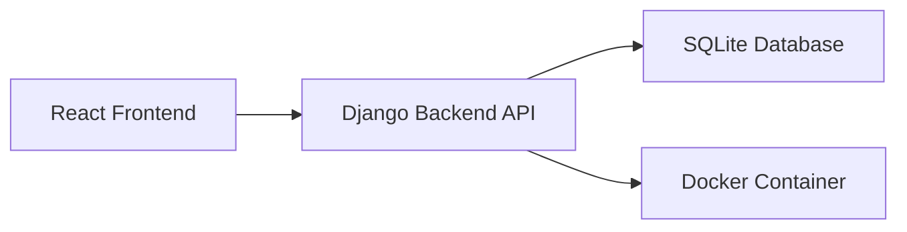

<p align="center">
  <h1 align="center">CommerceForge</h1>
  <p align="center">
    Modernized Django + React Ecommerce Backend Architecture Project
  </p>
</p>

---

# CommerceForge

A modernized and backend-focused ecommerce platform built using:

- :contentReference[oaicite:0]{index=0}
- :contentReference[oaicite:1]{index=1}
- :contentReference[oaicite:2]{index=2}
- :contentReference[oaicite:3]{index=3}
- SQLite (development)
- REST APIs
- Containerized backend architecture

This project started as a learning and modernization initiative inspired by an open-source Django + React ecommerce repository and is being progressively refactored into a cleaner, production-oriented backend system.

---

# Project Goals

This project focuses heavily on:

- Backend architecture
- Clean code structure
- API design
- Dockerized development
- Performance optimization
- Scalable backend patterns
- Testing infrastructure
- Benchmarking and profiling
- Legacy project modernization

---

# Current Improvements

## Backend Modernization

- Dockerized backend environment
- Isolated Python runtime
- Reproducible development setup
- Cleaner local development workflow
- Dependency stabilization for legacy Django stack

## Architecture Focus

Planned improvements include:

- Service layer architecture
- Repository pattern
- API versioning
- Caching layer
- Async task processing
- Benchmark testing
- Query optimization
- Production deployment setup

---

# System Architecture



---

# Backend Development Workflow

## Local Development

```bash
python -m venv venv
source venv/bin/activate

pip install -r requirements.txt

python manage.py runserver
```

---

# Dockerized Backend Workflow

## Build Container

```bash
docker build -t commerceforge-backend .
```

## Run Container

```bash
docker run -p 8000:8000 -v $(pwd):/app commerceforge-backend
```

Backend runs on:

```text
http://localhost:8000
```

---

# Frontend Development Workflow

```bash
npm install
npm start
```

---

# Deployment Goals

Planned deployment stack:

- Dockerized services
- Reverse proxy
- Environment-based configuration
- Production-grade settings
- Static/media handling
- CI/CD integration

---

# Learning Objectives

This repository is also being used as a backend engineering learning project covering:

- Legacy system modernization
- Backend scalability
- System design
- API performance testing
- Containerization
- Production architecture
- Backend optimization

---

# Inspiration & Credits

Initial project inspiration taken from:

:contentReference[oaicite:4]{index=4}

Original repository inspired by content from:

:contentReference[oaicite:5]{index=5}

This repository has been independently modified and extended with backend-focused architectural improvements and Dockerized infrastructure.

---

# Planned Roadmap

## Phase 1 — Legacy Stabilization
- Fix dependency issues
- Dockerize backend
- Normalize environments

## Phase 2 — Backend Refactor
- Service layer
- Cleaner APIs
- Modular architecture

## Phase 3 — Performance Engineering
- Redis caching
- Query optimization
- Benchmark testing

## Phase 4 — Production Readiness
- CI/CD
- Deployment setup
- Monitoring & observability

---

# License

This repository is intended for educational and engineering portfolio purposes.